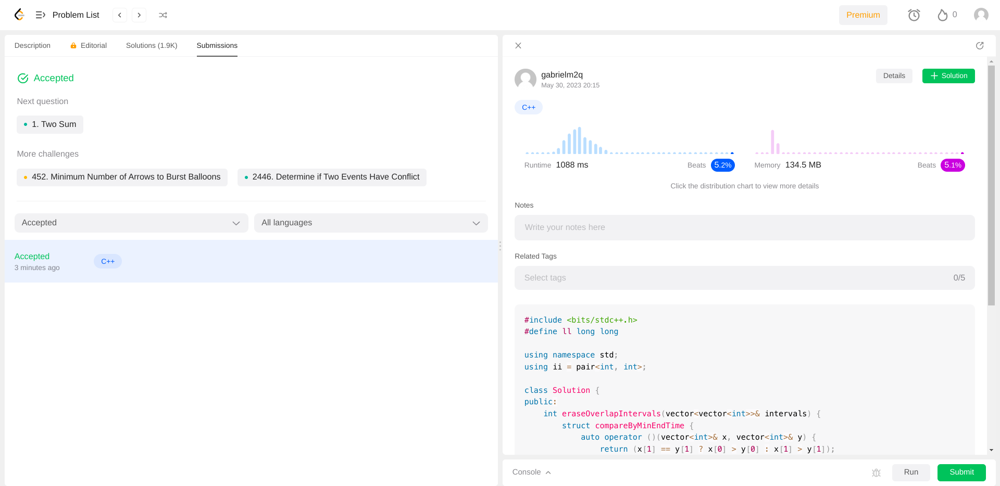

# Greedy Exercises

**Conteúdo da Disciplina**: Algoritmos Ambiciosos<br>

## Alunos

|Matrícula | Aluno |
| -- | -- |
| 19/0105267  |  Diógenes Dantas Lélis Júnior |
| 20/0018167  |  Gabriel Mariano da Silva |

## Sobre

Este projeto teve como foco a resolução de problemas de **Algoritmos Ambiciosos** (Greedy Algorithms) nas plataformas *LeetCode*, *BeeCrowd* e *CSES*.

## Apresentação

Caso queira ver a apresentação do projeto desenvolvido por parte dos integrantes da equipe, basta acessar o [**LINK DO YOUTUBE**](www.youtube.com) ou então baixar o vídeo completo no [**LINK DO VÍDEO**](www.google.com).

## Screenshots

## Movie Festival II


## Stick Divisions


## [435] Non-overlapping Intervals

[**Link do Problema**](https://leetcode.com/problems/non-overlapping-intervals/description/)

[**Resposta Comentada**](./Exercises/435_NonOverlappingIntervals/commented/435_NonOverlappingIntervals.md)



## [1642] Furthest Building

[**Link do Problema**](https://leetcode.com/problems/furthest-building-you-can-reach/)

[**Resposta Comentada**](./Exercises/1642_FurthestBuilding/commented/1642_FurthestBuilding.md)


## [1661] Wine Trading in Gergovia

[**Link do Problema**](https://www.beecrowd.com.br/judge/en/problems/view/1661)

[**Resposta Comentada**](./Exercises/1661_WineTradingGergovia/commented/1661_WineTradingGergovia.md)


## [2115] Production in Ekaterinburg

[**Link do Problema**](https://www.beecrowd.com.br/judge/en/problems/view/2115)

[**Resposta Comentada**](./Exercises/2115_ProductionEkaterinburg/commented/2115_ProductionEkaterinburg.md)


## Tecnologias

**Linguagem**: *C++* (C++17)<br>
**Compilador**: *G++* <br>

* Caso não tenha o compilador *G++* instalado, veja a seção *Outros* no tópico *Compilador*.

## Execução

Os algoritmos disponibilizados foram executados majoritariamente nas respectivas plataformas de onde foram disponibilizados.

Todavia, caso deseje executar os algoritmos em sua máquina, siga os passos:

Primeiramente, clone o repositório em sua máquina:

```
git clone git@github.com:projeto-de-algoritmos/Greed_GreedyExercises.git
```

Após isso, entre na pasta do projeto e então entre na pasta *Exercises*, na qual as pastas com os algoritmos estão localizadas:

```
cd Greed_GreedyExercises/Exercises/
```

Logo após, entre na pasta do algoritmo do exercício desejado (ver seção **Outros**):

```
cd *nome da pasta do algoritmo desejado*
```

Finalmente, caso o algoritmo seja passível de execução em máquina local (ver seção **Outros**), basta inserir o caso de teste no arquivo *in* (caso não exista, basta criar um arquivo sem extensão com nome *in*), compilar o algoritmo e executá-lo:

```
g++ *nome_do_algoritmo*.cpp -o Exer

./Exer < in
```

## Outros

### Execução em máquina local

Destaca-se apenas que os algoritmos desenvolvidos para a plataforma *LeetCode* devem ser executados na mesma e não em máquina local devido à sua estrutura. Para tal, basta entrar na página do exercício em questão, colar o código original e clicar em *Run* para executar os casos de teste disponibilizados.

### Compilador

Os algoritmos foram desenvolvidos em C++. Para compilar e executar seus arquivos, é necessário ter o compilador **G++** instalado. Para tal, basta seguir as instruções para as plataformas [*Linux*](https://linuxhint.com/install-and-use-g-on-ubuntu/) e [*Windows*](https://www.freecodecamp.org/news/how-to-install-c-and-cpp-compiler-on-windows/).

Todavia, também é possível executar os algoritmos nas plataformas de onde os exercícios foram retirados ou por ambientes de programação on-line, como, por exemplo, o [*OnlineGDB*](https://www.onlinegdb.com/).
