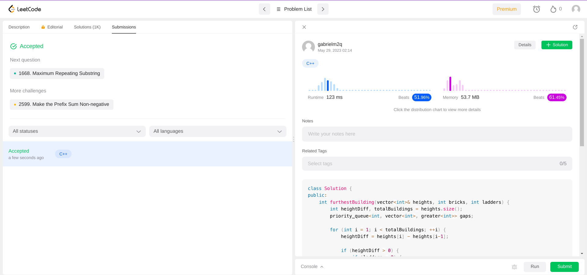

# Greedy Exercises

**Conteúdo da Disciplina**: Algoritmos Ambiciosos 

## Alunos

|Matrícula | Aluno |
| -- | -- |
| 19/0105267  |  Diógenes Dantas Lélis Júnior |
| 20/0018167  |  Gabriel Mariano da Silva |

## Sobre

Este projeto teve como foco a resolução de problemas de Algoritmos Ambiciosos (Greedy Algorithms) nas plataformas *LeetCode*, *BeeCrowd* e *CSES*. Cada membro da equipe contribuiu com a resolução de três questões, totalizando seis exercícios no total.

## Screenshots

## Movie Festival II

## Stick Divisions

## [1642] Furthest Building

[**Link do Problema**](https://leetcode.com/problems/furthest-building-you-can-reach/)

## [1661] Wine Trading in Gergovia

[**Link do Problema**](https://www.beecrowd.com.br/judge/en/problems/view/1661)

## [2115] Production in Ekaterinburg

[**Link do Problema**](https://www.beecrowd.com.br/judge/en/problems/view/2115)

## Instalação

**Linguagem**: *C++* (C++17) 

## Outros

Em andamento.
